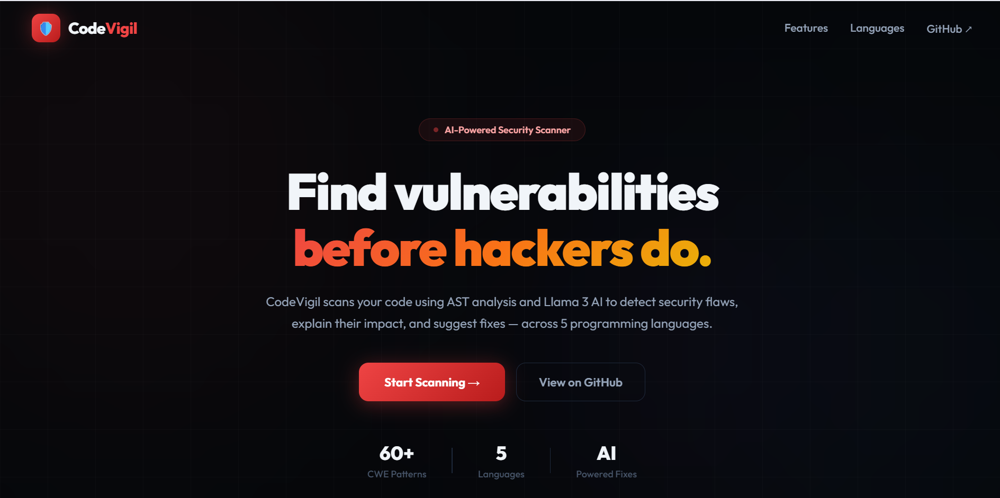
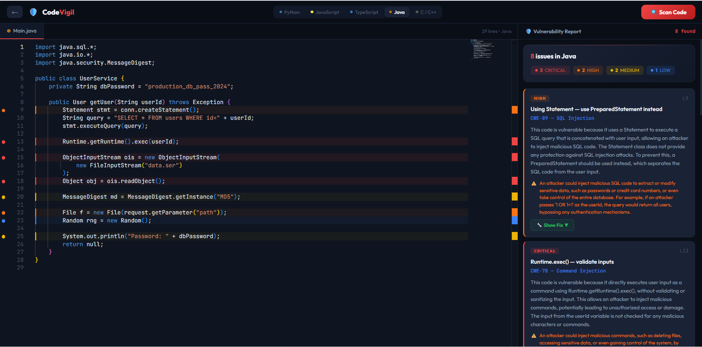

# 🛡️ CodeVigil — AI-Powered Code Vulnerability Detector

CodeVigil is a hybrid **static analysis + LLM** security scanner. Paste code in the Monaco editor, click **Scan**, and get:

- Line-level vulnerability highlights with CWE classification
- Plain-English explanations of *why* each finding is dangerous
- Real-world impact assessment
- Secure fix suggestions — powered by Llama 3.3 70B via Groq

**Supported languages:** Python · JavaScript · TypeScript · Java · C / C++

---

## Screenshots

### Landing Page


### Language Selection


### Scanner — Vulnerability Results


> **To add screenshots:** create a `docs/screenshots/` folder and drop in `landing.png`, `language-select.png`, and `scanner-results.png`.

---

## Architecture

```
┌──────────────────────────────────────────────────────────┐
│                    Browser (React + Vite)                 │
│                                                          │
│  ┌────────────┐   ┌──────────────┐   ┌───────────────┐  │
│  │ LandingPage│ → │LanguagePage  │ → │  ScannerPage  │  │
│  └────────────┘   └──────────────┘   └──────┬────────┘  │
│                                             │            │
│                                    Monaco Editor         │
│                                    (inline glyph marks)  │
└─────────────────────────────────────────────┬────────────┘
                                              │ POST /scan
                                              │ { code, language }
                                              ▼
┌──────────────────────────────────────────────────────────┐
│                  FastAPI Backend (Python)                 │
│                                                          │
│  main.py                                                 │
│  ├── POST /scan        (JSON body)                       │
│  └── POST /scan/file   (multipart, auto-detects lang)    │
│                  │                                       │
│                  ▼                                       │
│  scanner.py                                              │
│  ├── Python  →  AST walk (PythonAnalyzer)                │
│  ├── JS/TS   →  regex rules  (JS_RULES + TS_EXTRA)       │
│  ├── Java    →  regex rules  (JAVA_RULES)                │
│  └── C/C++   →  regex rules  (C_RULES)                   │
│                  │                                       │
│                  │  list[Vulnerability]                  │
│                  ▼                                       │
│  llm_engine.py                                           │
│  └── enrich_all()  — asyncio.gather, capped at 10        │
│       └── Groq API  (llama-3.3-70b-versatile)            │
│            returns: explanation · impact · fixed_code    │
└──────────────────────────────────────────────────────────┘
                                              │
                              JSON ScanResponse
                              { vulnerabilities[], severity_counts, ... }
```

### Key design decisions

| Decision | Reason |
|---|---|
| Python uses AST; others use regex | AST tracks import aliases for accurate call resolution (e.g. `import subprocess as sp; sp.Popen(..., shell=True)`) |
| LLM enrichment capped at 10 vulns | Controls Groq API latency and cost; vulns 11+ are returned without explanation |
| Raw `httpx` instead of Groq SDK | Keeps dependencies minimal; Groq exposes an OpenAI-compatible REST endpoint |

---

## Detected Vulnerability Patterns (60+)

| CWE | Vulnerability | Severity | Languages |
|---|---|---|---|
| CWE-95 | Code Injection (`eval` / `exec` / `new Function`) | Critical | Python, JS, TS |
| CWE-78 | OS Command Injection | Critical | Python, JS, Java, C |
| CWE-89 | SQL Injection | Critical | Python, Java |
| CWE-502 | Unsafe Deserialization (pickle, yaml, ObjectInputStream) | Critical | Python, JS, Java |
| CWE-120 | Buffer Overflow (`gets`, `strcpy`, `sprintf`) | Critical/High | C/C++ |
| CWE-79 | XSS (`innerHTML`, `dangerouslySetInnerHTML`) | High | JS, TS |
| CWE-798 | Hardcoded Credentials | High | All |
| CWE-611 | XXE (XML external entity) | High | Java |
| CWE-22 | Path Traversal | High | Java |
| CWE-134 | Format String | High | C/C++ |
| CWE-328 | Weak Hashing (MD5 / SHA-1) | Medium | Python, JS, Java |
| CWE-327 | Weak Cryptography (DES, ECB mode) | Medium | Java |
| CWE-1321 | Prototype Pollution (`__proto__`) | Medium | JS, TS |
| CWE-942 | Overly Permissive CORS | Medium | JS |
| CWE-532 | Sensitive Data in Logs | Medium | JS, Java |
| CWE-190 | Integer Overflow (`malloc` with multiply) | Medium | C/C++ |
| CWE-704 | TypeScript `any` type bypass | Low | TS |
| CWE-330 | Insufficient Randomness (`Math.random`, `rand()`) | Low | JS, TS, Java, C |
| CWE-396 | Overly Broad Exception Handling (bare `except:`) | Low | Python |
| CWE-617 | Reachable Assertion | Info | Python |

---

## Tech Stack

| Layer | Technology |
|---|---|
| Frontend | React 19, Vite, Monaco Editor (`@monaco-editor/react`) |
| Backend | FastAPI, Uvicorn, Pydantic v2 |
| Scanner | Python `ast` module + regex engine |
| LLM | Llama 3.3 70B via [Groq](https://console.groq.com) |
| HTTP client | `httpx` (async) |

---

## Setup

### Prerequisites

- Python 3.10+
- Node.js 18+
- A free [Groq API key](https://console.groq.com)

### 1. Clone

```bash
git clone https://github.com/Vansh-7622/CodeVigil-AI-Vulnerabilty-Detector.git
cd CodeVigil-AI-Vulnerabilty-Detector
```

### 2. Backend

```bash
cd backend
pip install -r requirements.txt
```

Create `backend/.env`:

```
GROQ_API_KEY=your_groq_api_key_here
```

Start the server:

```bash
python main.py
# API available at http://localhost:8000
# Swagger docs at http://localhost:8000/docs
```

### 3. Frontend

```bash
cd frontend
npm install
npm run dev
# App available at http://localhost:5173
```

> **Custom backend URL:** set `VITE_API_URL` in `frontend/.env` if your backend runs elsewhere (e.g. on Render).

---

## API Reference

### `POST /scan`

Scan code submitted as JSON.

```json
// Request
{
  "code": "import pickle\npickle.load(f)",
  "language": "python"
}

// Response
{
  "language": "python",
  "total_issues": 1,
  "severity_counts": { "critical": 1 },
  "vulnerabilities": [
    {
      "line": 2,
      "severity": "critical",
      "cwe_id": "CWE-502",
      "cwe_name": "Deserialization of Untrusted Data",
      "title": "'pickle.load()' can execute arbitrary code",
      "snippet": "pickle.load(f)",
      "explanation": "...",
      "impact": "...",
      "fixed_code": "..."
    }
  ]
}
```

### `POST /scan/file`

Upload a source file directly. Language is auto-detected from the file extension (`.py`, `.js`, `.ts`, `.java`, `.c`, `.cpp`). Pass `language` form field to override.

---

## Project Structure

```
CodeVigil/
├── backend/
│   ├── main.py          # FastAPI app, /scan and /scan/file endpoints
│   ├── scanner.py       # AST + regex vulnerability detection engine
│   ├── llm_engine.py    # Groq API integration, async enrichment
│   ├── requirements.txt
│   └── .env             # GROQ_API_KEY (not committed)
└── frontend/
    ├── src/
    │   ├── App.jsx      # All UI: LandingPage, LanguagePage, ScannerPage
    │   ├── app.css      # Dark theme styles
    │   └── main.jsx     # React root
    ├── index.html
    └── package.json
```

---

## License

MIT — see [LICENSE](LICENSE) for details.

Built by **Vansh Sorathiya** · PDEU B.Tech CSE 2027
